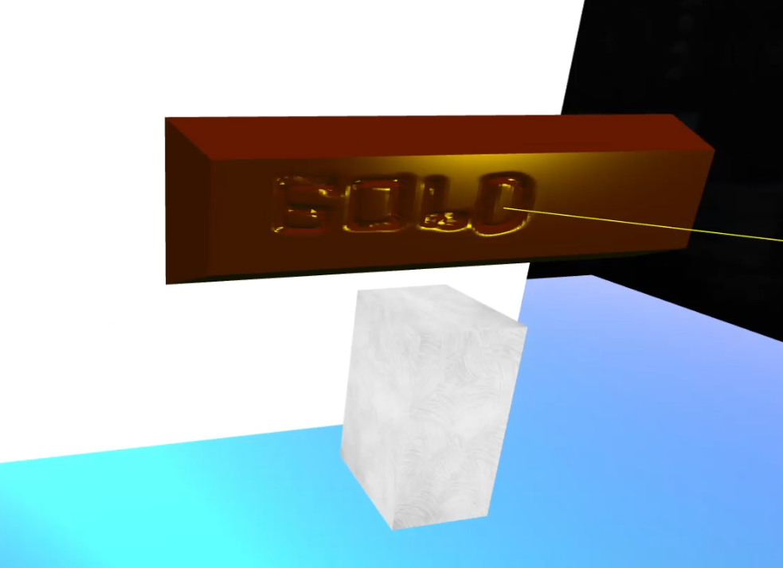

## The Museum of Precious Metals & Minerals

A 3D virtual museum application. Developed as a term project of the Computer Graphics class. Utilized various computer graphics concepts including but not limited to lighting, texture mapping, and shading, which we learned throughout the semester.

---

- **Live at:** https://baturalpk.dev/The-Museum-of-PMM/

> **Note:** The initial load may take a while.

---

### Screenshots 🖼

